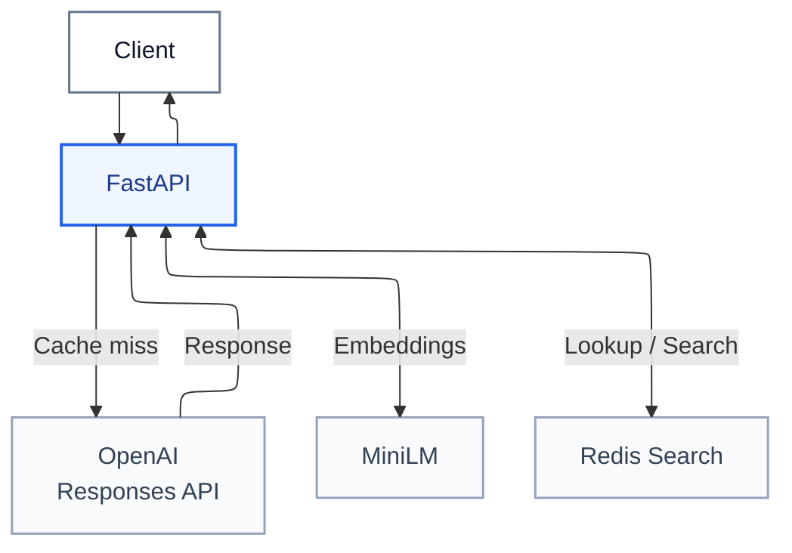

# Semantic Cache for LLMs

**Exploring when an LLM response can be reused and when it should not be.**

This project investigates a practical question: if two prompts ask for the same thing, can a previous answer be reused instead of generating another one?

The goal is to measure the potential savings without treating semantic similarity as proof that two questions deserve the same answer.

Addressing this problem with a general-purpose LLM would be impractical: the potentially infinite variety of questions, contexts and intents makes it difficult to determine when two requests truly deserve the same answer. In a more constrained setting, however, it is possible to define rules, policies and reusable responses more precisely. For example, an internal assistant could answer questions about human resources procedures, a technical support bot could cover only a product's configuration and known errors, or a customer service chat could address questions about payments, shipping and returns. This project uses the latter case as an example: an LLM used as a support chat for an online store.


## Table of contents

- [Purpose](#purpose)
- [Architecture](#architecture)
- [Request flow](#request-flow)
- [Cache behavior](#cache-behavior)
- [API](#api)
- [Run locally](#run-locally)
- [Evaluation modes](#evaluation-modes)
- [Manual evaluation](#manual-evaluation)
- [Automatic evaluation](#automatic-evaluation)
- [Results](#results)
- [Threshold comparison](#threshold-comparison)
- [Calls avoided for reformulated questions](#calls-avoided-for-reformulated-questions)
- [Implementation decisions](#implementation-decisions)
- [Tests](#tests)
- [Repository guide](#repository-guide)
- [Next steps](#next-steps)

## Purpose

An exact-match cache recognizes repeated text. A semantic cache also attempts to recognize equivalent requests written differently:

> “Which payment methods do you accept?”
>
> “What payment options are available?”

When the same answer is suitable for both, reusing it avoids another generation request. However, similar wording can describe different needs: cancelling an order before shipping is different from cancelling it afterwards.

The project explores this trade-off: **recover more reusable responses while measuring incorrect reuse**, rather than optimizing cache hit rate alone.

## Architecture

### Overview



| Component | Architecture role |
|---|---|
| Client | Sends questions and context to the API and receives the answer, cache status, similarity score and latency. |
| FastAPI | Serves as the orchestration layer: validates requests, checks cache eligibility, coordinates exact and semantic lookups, calls OpenAI on misses and stores successful responses. |
| MiniLM* | Converts eligible questions into normalized 384-dimensional embeddings so semantically similar requests can be compared. It does not generate answers. |
| Redis | Stores cached responses, embeddings and context, then performs exact matching and vector similarity search to find reusable answers. |
| OpenAI | Generates the response when no eligible cached answer meets the similarity threshold; its output is stored only when the request and response satisfy the cache rules. |
| OpenAI** | Generates the response when no eligible cached answer meets the similarity threshold; its output is stored only when the request and response satisfy the cache rules. |

\* *Embedding model: `sentence-transformers/all-MiniLM-L6-v2`, with a pinned revision. It runs on CPU inside Docker.*  
\*\* *Response-generating LLM: accessed through OpenAI. The configured default is `gpt-4.1-mini-2025-04-14`.*

### Request flow

1. **Ask a question.** The user sends a question and its context to the API.
2. **Check cache eligibility.** The current support filter excludes personal, time-sensitive and out-of-scope requests. Excluded requests go to the LLM and are not stored.
3. **Look for an exact match.** A matching question in the same context returns its stored response without embedding or generation.
4. **Search by meaning.** On an exact miss, the embedding service encodes the question and Redis finds the nearest eligible entry.
5. **Apply the similarity threshold.** At the default threshold of **0.78**, a sufficiently similar candidate is reused.
6. **Generate on a miss.** OpenAI generates an answer. Only complete, successful, non-empty text responses are stored for eligible requests.
7. **Return and store the response.** The API returns the generated or cached response to the client. On an eligible cache miss, the response is also stored for future requests.

### Cache behavior

The project uses a **hybrid exact-match and semantic cache** backed by Redis:

- **Exact match:** the question is looked up together with its cache context. A match returns the stored response without embedding or LLM generation.
- **Semantic match:** after an exact miss, MiniLM converts the question into a normalized 384-dimensional embedding. Redis Search finds the nearest eligible entry using cosine similarity, and reuses it when it reaches the default threshold of **0.78**.
- **Cache scope:** system instructions, model, temperature, output-token limit, embedding version and support-policy revision separate entries produced under incompatible settings. This is not full tenant isolation.
- **Storage and expiration:** Redis stores the response, question, embedding and scope metadata. Entries expire after the configured TTL, one hour by default. The vector index uses exact `FLAT` search with `FLOAT32` vectors, which is suitable for this demo-scale workload.

Requests excluded by the support policy bypass cache lookup and are never stored. Failed, incomplete or empty LLM responses are also not cached.

### API

| Endpoint | Purpose |
|---|---|
| `POST /v1/chat` | Look up a response or generate a new one |
| `GET /v1/cache/stats` | Return entry count, hits, misses and hit rate |
| `DELETE /v1/cache` | Clear the active cache and counters without flushing unrelated Redis data |


## Run locally

Requirements: Python 3.11+, Poetry and Docker Compose.

All settings are read from `.env` or environment variables:

| Setting | Default |
|---|---|
| `OPENAI_API_KEY` | Empty; required for generation |
| `OPENAI_MODEL` | `gpt-4.1-mini-2025-04-14` |
| `OPENAI_TIMEOUT_SECONDS` | `60` |
| `OPENAI_MAX_OUTPUT_TOKENS` | `1024` |
| `EMBEDDINGS_URL` | `http://127.0.0.1:8001` |
| `REDIS_URL` | `redis://localhost:6379/0` |
| `CACHE_TTL_SECONDS` | `3600` |
| `CACHE_NAMESPACE` | `semantic-cache` |

If .env does not exist, copy .env.example to .env and set OPENAI_API_KEY for real generation. Then install the project:

```bash
poetry install
```

Start the Redis and embeddings services:

```bash
docker compose -f docker-compose.services.yml up -d --build --wait --wait-timeout 600
```

The first Docker startup downloads the embedding model. Later starts reuse the model volume. Then start the API:

```bash
poetry run uvicorn app.main:app --reload
```

Wait until the API is available at <http://127.0.0.1:8000/docs>. Keep Docker services and the API running for the entire evaluation.

## Evaluation modes

The project can be evaluated in two complementary ways. The manual mode exercises the API with a specific request and makes the cache behavior easy to inspect. The automatic mode runs a fixed dataset through the real embedding service and Redis, making threshold comparisons reproducible.

### Manual evaluation

Send an eligible question with an explicitly fictional store policy. Of course you can try different question topics not releated with a shop.

```bash
curl http://127.0.0.1:8000/v1/chat \
  -H 'Content-Type: application/json' \
  -d '{
    "prompt": "What payment options are available?",
    "system_prompt": "You support a fictional demo store. Accepted payment methods are Visa, Mastercard and PayPal. Use only this policy; refer unknown details to support.",
    "temperature": 0
  }'
```

If you prefer a more "user-friendly" environment instead of a terminal, open [the API documentation](http://127.0.0.1:8000/docs), here you can run the same request.


The first request is always a cache miss and calls OpenAI. Repeating it should return `cached: true`. Changing only the wording of the question tests semantic reuse; keep the system instructions and generation parameters unchanged so the requests remain in the same cache scope. The response also exposes the cache status, similarity score and latency.

### Automatic evaluation

The automatic evaluation uses the support workload in [`datasets/`](datasets/). It contains 100 labeled queries: ten exact duplicates, forty paraphrases, thirty similar questions that require different answers and twenty requests excluded by the support policy. The ten reference questions are loaded into an isolated Redis namespace, and each query is checked against its expected reference identifier. Misses are not added to the cache, so every query is evaluated against the same baseline.

Note: These commands do not consume OpenAI API credits. Evaluators use temporary namespaces and remove their own entries and indices afterwards.

Run the support evaluation with Docker services running:

```bash
poetry run python -m app.validate_support
```

This evaluates the support workload and writes `validation/store-support/report.json`. The report includes the evaluated cases, reuse decisions, and metrics such as precision, paraphrase hits and lookup latency.

To reproduce the recorded threshold comparison, run:

```bash
poetry run python -m app.compare_cutoffs
```

This compares thresholds `0.80` and `0.78` and writes the results to `validation/cutoff-comparison/report.json`, including the queries whose reuse decision changes between the two thresholds.

This comparison evaluates thresholds 0.80 and 0.78 on the same synthetic workload. It is retrospective rather than a new held-out test. The separate, general-purpose [`dataset.jsonl`](dataset.jsonl) remains a stress test and should not be combined with the support workload.

## Results

These results are based on the labeled support workload in [`datasets/`](datasets/)

### Threshold comparison

| Metric | Threshold 0.80 | Current threshold 0.78 |
|---|---:|---:|
| Correct response reuse | 27 | **31** |
| Incorrect response reuse | 1 | **2** |
| Correct paraphrase reuse | 17/40 | **21/40** |
| Precision among reused responses | 96.4% | **93.9%** |
| Excluded requests that bypassed caching | 20/20 | **20/20** |

The lower threshold recovers **four additional correct responses at the cost of one additional incorrect reuse**. The 31 correct reuses include ten exact duplicates and twenty-one paraphrases.

### Calls avoided for reformulated questions

At the selected cosine-similarity threshold of **0.78** for the store-support cache, **21 of 40 paraphrases retrieved the correct stored response**. This threshold was chosen because the comparison above showed a useful trade-off: it increased correct reuse from 27 to 31 cases compared with `0.80`, at the cost of one additional incorrect reuse (from 1 to 2).

```text
Correct reuse on non-identical, equivalent questions = 21 / 40 = 52.5%
```

**In this specific benchmark scenario, these correctly reused requests skip the LLM call, reducing LLM calls for reformulated questions by approximately half.**

The benchmark uses reference identifiers as placeholder answers. It does not evaluate generated answer quality, token consumption or billed OpenAI requests.

## Tests

The test suite has **63 tests**. Coverage includes real Redis lookup, isolation and TTL behavior, Docker embeddings, API behavior, scope exclusions and OpenAI error handling. OpenAI transport is mocked in tests.

With Docker services running:

```bash
poetry run pytest -q
poetry run ruff check app tests services
```

## Repository guide

- [`app/`](app/) — API, cache engine, clients, support policy and evaluation commands.
- [`services/embeddings/`](services/embeddings/) — Docker inference service and historical experiments.
- [`datasets/`](datasets/) — Support development and evaluation queries.
- [`tests/`](tests/) — Unit, contract and integration tests.
- [`validation/`](validation/) — Recorded evaluation results and per-query decisions.

## Next steps

This project shows that it is possible to implement a semantic cache capable of significantly reducing the need to call an LLM for every request. When a new query is sufficiently similar to one that has already been answered, the stored response can be reused instead of running another inference, **reducing latency and potentially lowering costs.**

The repository is only an introduction to how such a solution could be implemented. In a production environment, additional considerations would still be necessary, including domain-specific evaluation, expiration and invalidation policies, observability, security and privacy controls, careful threshold tuning, and fallback mechanisms for cases where reusing a response is not appropriate.
